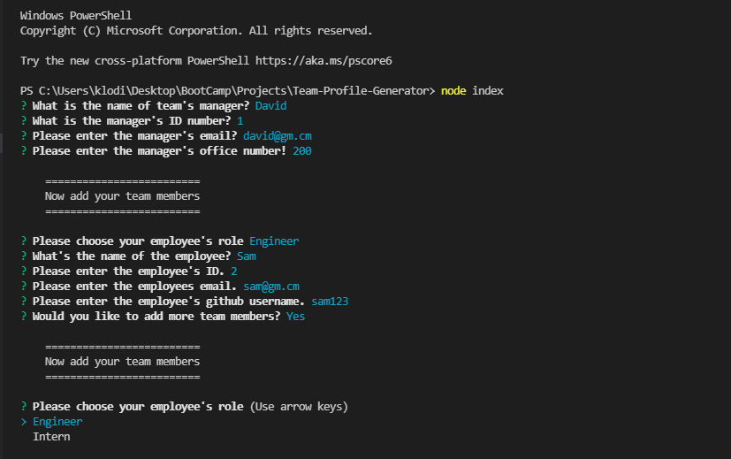
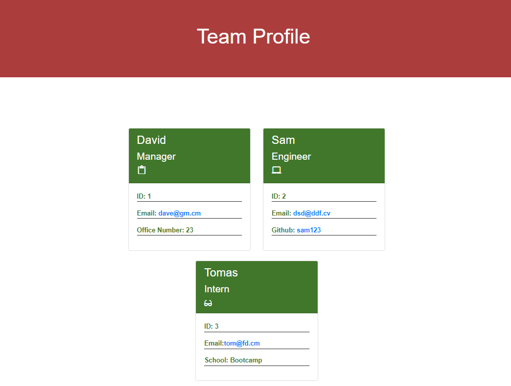

# Team-Profile-Generator  

## Describtion

A Node.js command-line application that takes in information about employees on a software engineering team based on user input using the Inquirer module from Node.js, 
then generates an HTML webpage that displays summaries for each person.

This project demonstrates use of OOP and TDD using Jest.

A link to a walkthrough video that demonstrates the functionality of the Team Profile Generator and passing tests is here: [video](assets/records/demo.webm)

## Table of contents

  - [Describtion](#describtion)
  - [Table of contents](#table-of-contents)
  - [Technologies](#technologies)
  - [Instalation](#instalation)
  - [Usage](#usage)
  - [License](#license)
  - [Tests](#tests)
  - [Questions](#questions)

## Technologies

 - HTML                
 - CSS                 
 - JavaScript          
 - Bootstrap          
 - Git
 - NodeJs
 - OOP
 - NPM
## Instalation

The user should clone the repository from GitHub and download Node. This application also requires a file system and inquirer module. If testing is required, this application uses Jest.

 - Below is a demo for using this app:

  

## Usage

 - Use inquirer from your command line to answer questions about your project:

  .

  - Will generate html page:

  .

## License

This project is license under [MIT](https://opensource.org/licenses/MIT)

## Tests

Run npm test to run Jest for tests on constructors.

## Questions

For any questions, please contact me directly at (samerbalee@gmail.com)  

You can view more of my projects at  [GitHub](https://github.com/Samer-Balee)